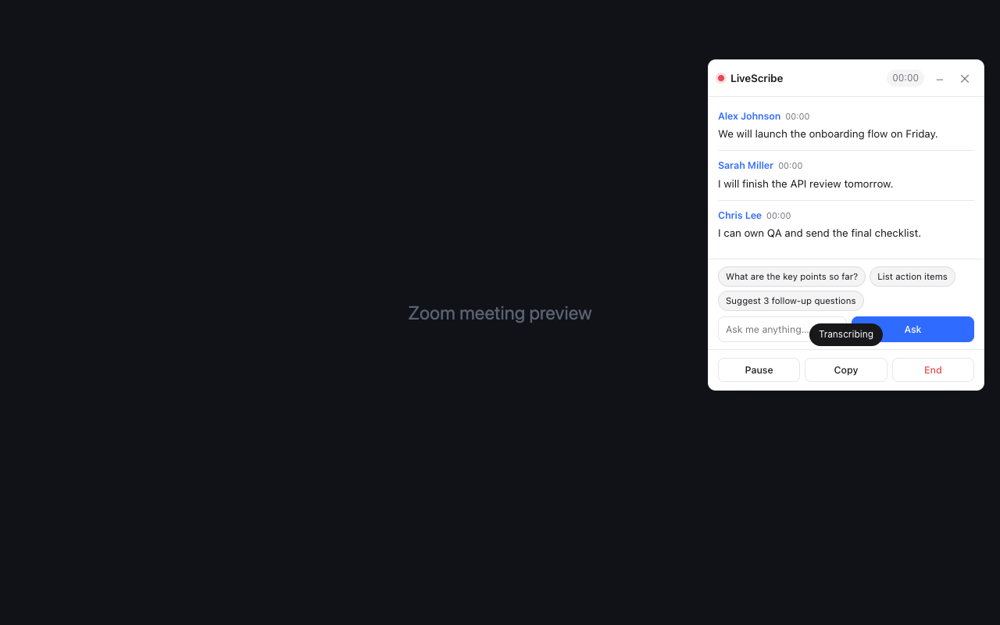
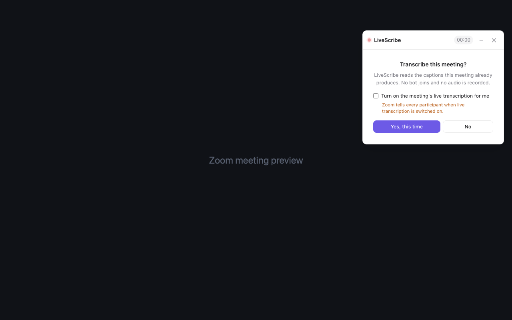

<a id="readme-top"></a>

<div align="center">
  <a href="https://chromewebstore.google.com/detail/gfhncbgjiechicicabgkmlmcljamdelf">
    
  </a>

  <h1>LiveScribe</h1>

  <p>
    Live meeting transcripts and AI notes, directly inside your browser.
    <br />
    No meeting bot. No audio recording. You choose when transcription starts.
  </p>

  <p>
    <a href="https://chromewebstore.google.com/detail/gfhncbgjiechicicabgkmlmcljamdelf"><strong>Install from the Chrome Web Store &rarr;</strong></a>
    <br />
    <br />
    <a href="https://wenqiw777.github.io/livescribe-store/">Website</a>
    &middot;
    <a href="https://wenqiw777.github.io/livescribe-store/support.html">Support</a>
    &middot;
    <a href="https://github.com/wenqiw777/livescribe-store/issues">Report a bug</a>
    &middot;
    <a href="https://github.com/wenqiw777/livescribe-store/issues">Request a feature</a>
  </p>

  [![Chrome Web Store][chrome-store-shield]][chrome-store-url]
  [![Version][version-shield]][chrome-store-url]
  [![MIT License][license-shield]][license-url]
</div>

<br />



LiveScribe captures the captions that Zoom, Google Meet, and Microsoft Teams already produce. It turns them into a readable, speaker-labelled transcript and—if you connect your own Anthropic or OpenAI API key—lets you ask questions and create meeting summaries without sending a bot into the call.

<details>
  <summary><strong>Table of contents</strong></summary>
  <ol>
    <li><a href="#why-livescribe">Why LiveScribe</a></li>
    <li><a href="#features">Features</a></li>
    <li><a href="#getting-started">Getting started</a></li>
    <li><a href="#how-it-works">How it works</a></li>
    <li><a href="#privacy-and-consent">Privacy and consent</a></li>
    <li><a href="#development">Development</a></li>
    <li><a href="#developer-ai-companion">Developer AI Companion</a></li>
    <li><a href="#contributing">Contributing</a></li>
    <li><a href="#license">License</a></li>
  </ol>
</details>

## Why LiveScribe

Meeting transcription tools often join as another participant, capture audio, or require a separate desktop app. LiveScribe stays in the browser and works with the live captions already provided by the meeting platform.

- **You stay in control.** LiveScribe asks before every meeting and provides an End button while transcription is active.
- **No bot joins.** Nothing new appears in the participant list.
- **No audio is recorded.** LiveScribe reads text captions instead of microphone or meeting audio.
- **AI is optional.** Transcription works without an API key; Ask and Summarize turn on only after you configure a provider.
- **Your choice of provider.** Use your own Anthropic or OpenAI API key and select from the supported models in Settings.

<p align="right">(<a href="#readme-top">back to top</a>)</p>

## Features

| Capability | What it does |
| --- | --- |
| Live transcript | Captures browser captions with speaker names as the meeting happens. |
| Meeting controls | Pause, resume, copy, and end transcription from the in-meeting panel. |
| Meeting Q&A | Ask for key points, action items, follow-up questions, or a custom answer. |
| AI summaries | Create a summary after a meeting with your selected provider and model. |
| Session separation | Ending one meeting finalizes that session; the next meeting starts a new transcript. |
| Local history | Keeps recent sessions in Chrome storage on your device. |
| Export | Saves transcripts and notes as text or Markdown. |
| Browser meetings | Supports Zoom Web Client, Google Meet, and Microsoft Teams on the web. |

### Consent before transcription

LiveScribe never starts silently. Each meeting begins with a clear choice, and transcription starts only after the user approves it for that meeting.



> LiveScribe does not replace the meeting platform's own disclosure controls. You are responsible for notifying participants and following the laws and policies that apply to your meeting.

<p align="right">(<a href="#readme-top">back to top</a>)</p>

## Getting started

### 1. Install LiveScribe

[Install LiveScribe from the Chrome Web Store][chrome-store-url], then pin it from Chrome's Extensions menu for easy access.

### 2. Open a supported meeting in the browser

LiveScribe works with:

- Zoom Web Client at `https://app.zoom.us/wc/...` and other `*.zoom.us` web meeting pages
- Google Meet at `https://meet.google.com/...`
- Microsoft Teams web meetings

Desktop meeting applications are not supported. The meeting platform's live captions or transcription must be available.

### 3. Choose whether to transcribe

Join the meeting and respond to LiveScribe's consent prompt. Choose **Yes, this time** to begin or **No** to leave transcription off.

### 4. Optional: connect AI

Open the extension popup, choose **Settings**, and select one provider:

- **Use my Anthropic API key**
- **Use my OpenAI API key**

Enter your key, select a model, and click **Save**. The key is stored in Chrome extension storage and requests go directly from the extension to the selected provider over HTTPS.

No AI provider is selected on a new install. Without one, live transcription and local session features continue to work while Ask and Summarize remain disabled.

<p align="right">(<a href="#readme-top">back to top</a>)</p>

## How it works

```text
Meeting platform captions
          │
          ▼
 LiveScribe extension ──────► Live transcript and local session history
          │
          └── only when you use Ask or Summarize
                            │
                            ▼
               Your selected AI provider
```

The public Chrome Web Store package contains only the extension runtime. It does not include the developer Native Messaging host, tests, Store documents, or local packaging tools found in this repository.

<p align="right">(<a href="#readme-top">back to top</a>)</p>

## Privacy and consent

- LiveScribe does not record meeting audio.
- Transcript data and settings are stored locally in Chrome extension storage.
- Caption text is sent to Anthropic or OpenAI only when you explicitly use an AI feature with that provider configured.
- LiveScribe does not sell personal data.
- Consent is requested separately for every meeting.

Read the full [Privacy Policy](https://wenqiw777.github.io/livescribe-store/privacy.html) and [Chrome Web Store disclosures](store/PRIVACY.md).

<p align="right">(<a href="#readme-top">back to top</a>)</p>

## Development

### Load the extension locally

1. Clone the repository:

   ```sh
   git clone https://github.com/wenqiw777/livescribe-store.git
   cd livescribe-store
   ```

2. Open `chrome://extensions`.
3. Enable **Developer mode**.
4. Choose **Load unpacked** and select this repository.
5. Join a supported browser meeting and confirm that LiveScribe asks before transcription starts.

### Repository layout

```text
livescribe-store/
├── manifest.json          Chrome Manifest V3 configuration
├── background.js          Session storage and AI provider requests
├── popup.*                Extension popup
├── options.*              Provider, API key, and model settings
├── src/                   Meeting capture and in-meeting panel
├── native-host/           Developer-only Native Messaging host
├── scripts/               Store and Companion packaging
├── store/                 Listing, privacy, review, and screenshot assets
├── test/                  Regression and Store-readiness tests
└── docs/                  GitHub Pages privacy and support site
```

### Verify

Run the Store readiness checks:

```sh
node test/store-readiness.test.js
node test/preflight.js
```

The complete regression suite requires `jsdom`:

```sh
deps=$(mktemp -d)
npm install --prefix "$deps" jsdom@26
for test_file in test/*.test.js; do
  NODE_PATH="$deps/node_modules" node "$test_file"
done
```

### Build the Chrome Web Store package

```sh
./scripts/package-store.sh
```

The archive is written to `dist/` with `manifest.json` at its root. Developer tools, tests, Store documents, screenshots, and Companion source are excluded.

<p align="right">(<a href="#readme-top">back to top</a>)</p>

## Developer AI Companion

The Companion is an unsupported local debugging path for developers who already have Codex CLI or Claude Code installed and signed in. It is deliberately hidden from the public **Use AI with** menu and is not required for transcription or API-key-based AI.

<details>
  <summary><strong>Show macOS setup and troubleshooting</strong></summary>

### Prerequisites

- macOS and a supported Chromium browser that has been opened at least once
- Node.js available as `node`
- Codex CLI as `codex`, Claude Code as `claude`, or both, already installed and signed in
- This repository cloned locally—the Chrome Web Store download does not contain the installer

### Register the local host

For the published Chrome Web Store extension:

```sh
git clone https://github.com/wenqiw777/livescribe-store.git
cd livescribe-store
./native-host/install.sh gfhncbgjiechicicabgkmlmcljamdelf
```

For a locally loaded extension, copy its 32-character ID from `chrome://extensions` and run:

```sh
./native-host/install.sh <YOUR_EXTENSION_ID>
```

The installer resolves the current `node`, `codex`, and `claude` paths, writes `native-host/run-host.sh`, and registers `com.livescribe.summarizer` for supported Chromium browsers found on the Mac.

### Reveal the private controls

1. Reload LiveScribe from `chrome://extensions` or restart Chrome.
2. Open **LiveScribe settings**.
3. Click the invisible 28 × 28 pixel area at the absolute bottom-left corner.
4. Select **Codex** or **Claude Code** in the revealed panel.
5. Click **Test Companion** and require `Connected ✓` before using it.

Selecting Anthropic or OpenAI again from the public **Use AI with** menu disables the Companion backend.

### Troubleshooting

- **Companion not found** or **not authorized:** rerun `install.sh` with the exact extension ID, then reload LiveScribe.
- **node not found:** install Node.js and confirm `command -v node` prints a path.
- **Neither claude nor codex found:** install and sign in to at least one supported CLI, then rerun the installer.
- **CLI works in Terminal but not LiveScribe:** rerun the installer so `run-host.sh` captures the current executable paths and login environment.

The hidden control simplifies the public UI; it is not an access-control mechanism. Native Messaging still restricts the local host to the extension ID passed to `install.sh`.

</details>

<p align="right">(<a href="#readme-top">back to top</a>)</p>

## Contributing

Issues and pull requests are welcome.

1. Fork the repository.
2. Create a focused branch.
3. Add or update regression coverage for behavior changes.
4. Run the verification commands above.
5. Open a pull request describing the user-visible result and how it was tested.

See the [open issues](https://github.com/wenqiw777/livescribe-store/issues) for known problems and proposed improvements.

<p align="right">(<a href="#readme-top">back to top</a>)</p>

## License

LiveScribe is open source under the [MIT License](LICENSE).

<p align="right">(<a href="#readme-top">back to top</a>)</p>

<!-- Reference-style links keep the main README easier to scan. -->
[chrome-store-shield]: https://img.shields.io/badge/Chrome_Web_Store-Install-4285F4?style=for-the-badge&logo=googlechrome&logoColor=white
[chrome-store-url]: https://chromewebstore.google.com/detail/gfhncbgjiechicicabgkmlmcljamdelf
[version-shield]: https://img.shields.io/badge/version-0.1.3-2F6BFF?style=for-the-badge
[license-shield]: https://img.shields.io/github/license/wenqiw777/livescribe-store.svg?style=for-the-badge
[license-url]: https://github.com/wenqiw777/livescribe-store/blob/main/LICENSE
